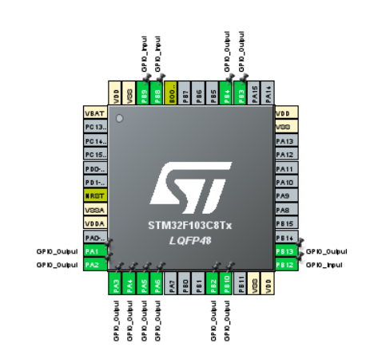
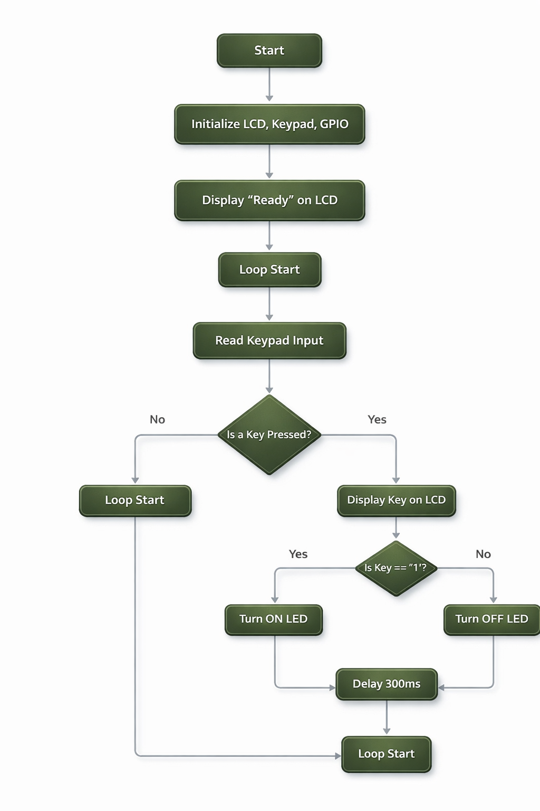

# Design Documentation

## 1. Design Overview

This document describes the **design phase** of the STM32 embedded system simulation project.  
The objective of this phase was to define a **clear hardware–software interface**, establish a **deterministic control logic**, and ensure that all GPIO resources were allocated correctly **before implementation and simulation**.

The design process focused on:
- Correct GPIO assignment
- Logical separation of system responsibilities
- Predictable and debounced user interaction
- Compatibility with simulation-based validation

---

## 2. Target Platform

- **Microcontroller:** STM32F103C8Tx (Blue Pill)
- **Core:** ARM Cortex-M3
- **Package:** LQFP48
- **Clock Source:** Internal HSI
- **Design Tool:** STM32CubeMX (via STM32CubeIDE)

The STM32F103C8 was selected due to its sufficient GPIO availability, simplicity, and suitability for educational embedded system design.

---

## 3. GPIO Configuration (IOC Design)

The GPIO configuration was created using **STM32CubeMX**.  
Only **GPIO peripherals** were required for this project, allowing full control over pin behavior and simplifying validation.

### 3.1 LCD Interface (4-Bit Mode)

The LCD operates in **4-bit mode** to reduce pin usage while maintaining full functionality.

| LCD Signal | STM32 Pin |
|-----------|-----------|
| RS | PA1 |
| E  | PA2 |
| D4 | PA3 |
| D5 | PA4 |
| D6 | PA5 |
| D7 | PA6 |

All LCD pins are configured as **push-pull outputs**.

---

### 3.2 Keypad Interface

A **4×3 matrix keypad** is interfaced using a row–column scanning technique.

- **Rows (outputs):** PB0, PB1, PB2, PB3  
- **Columns (inputs with pull-up):** PB4, PB5, PB6  

Internal pull-up resistors are enabled on the column pins to ensure stable logic levels and reliable key detection.

---

### 3.3 LED Output

- **PB13** is configured as a digital output.
- The pin drives an external LED through a current-limiting resistor.
- The LED state reflects the system logic based on keypad input.

---

### 3.4 IOC Pinout Screenshot

The following image shows the complete GPIO configuration as defined in STM32CubeMX:

This configuration ensures:
- No pin conflicts
- Clear functional separation
- Direct correspondence between design and implementation

---

## 4. System Logic Design

The system follows a **polling-based control model**, appropriate for the project scope and fully compatible with simulation constraints.

The logic is intentionally simple, deterministic, and easy to verify.

### 4.1 Logical Flow Description

1. System startup
2. Initialization of GPIO, LCD, and keypad
3. Display `"READY"` on the LCD
4. Enter infinite loop:
   - Scan keypad input
   - If no key is pressed → loop continues
   - If a key is detected:
     - Display the key on the LCD
     - Check key value:
       - If key equals `'1'` → LED ON
       - Otherwise → LED OFF
     - Apply a **300 ms debounce delay**
   - Return to loop start

This structure guarantees:
- Stable key detection
- No false triggers
- Predictable LED behavior

---

### 4.2 Flowchart Representation

The complete system logic is illustrated in the flowchart below:

The flowchart was created prior to coding and served as the reference for implementation, ensuring logical consistency between design and software behavior.

---

## 5. Design Rationale

- **Simulation-first approach:**  
  The design was optimized for verification in Proteus before any physical deployment.

- **Modularity:**  
  Each peripheral (LCD, keypad, LED) is treated as an independent functional block.

- **Simplicity and reliability:**  
  Polling and software debounce were chosen to ensure deterministic behavior without unnecessary complexity.

---

## 6. Design Summary

The design phase established a **clear, well-structured foundation** for the project.  
All GPIO assignments, logic decisions, and interaction flows were defined and validated at this stage, enabling a smooth transition to implementation and simulation.
