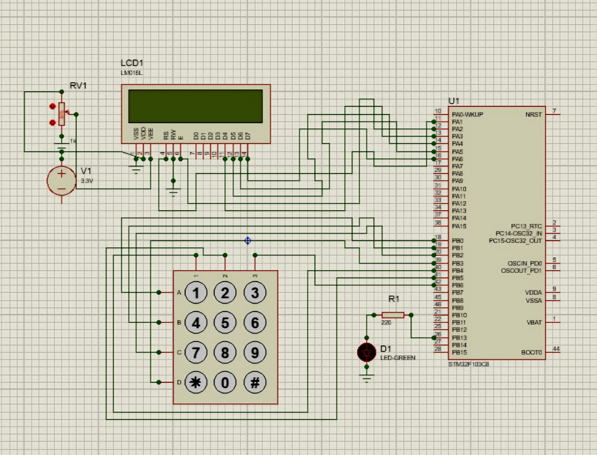

# Results and Validation

## Overview

This section presents the **results obtained from simulating the embedded system** using **Proteus 8 Professional**.  
The objective of this phase was to verify that the system behaves exactly as designed, correctly handling user input and producing the expected outputs in real time.

All tests were performed using the compiled STM32 firmware loaded into the Proteus simulation environment.

---

## Simulation Environment

- **Simulation Tool:** Proteus 8 Professional
- **Microcontroller:** STM32F103C8 (Blue Pill)
- **Firmware Source:** Compiled `.hex` file generated by STM32CubeIDE
- **Peripherals Simulated:**
  - 16×2 LCD (LM016L)
  - 4×3 Matrix Keypad
  - Green LED with current-limiting resistor
  - Potentiometer (LCD contrast control)

---

## Simulation Screenshot

The image below shows the complete system running in Proteus, including the STM32 microcontroller, LCD, keypad, LED, and supporting components.

---

## Observed System Behavior

During simulation, the system demonstrated the following behavior:

- On startup, the LCD correctly initialized and displayed the message **"READY"**.
- Keypad inputs were detected reliably through matrix scanning.
- When a key was pressed:
  - The LCD cleared its previous content and displayed the pressed key.
  - If the key was `'1'`, the LED turned **ON**.
  - For any other key, the LED turned **OFF**.
- The debounce delay prevented unintended multiple detections from a single key press.
- The system remained stable and responsive throughout the simulation.

---

## Validation Checklist

The following design and functional requirements were successfully validated:

- ✅ LCD initialization in 4-bit mode  
- ✅ Correct keypad matrix scanning  
- ✅ Accurate key-to-character mapping  
- ✅ Software debounce functioning as intended  
- ✅ Conditional LED control based on keypad input  
- ✅ Stable operation without runtime errors or undefined behavior  

---

## Discussion

The simulation results confirm that the system meets all functional objectives defined during the design phase.  
The interaction between multiple peripherals through GPIO was handled correctly, and the software architecture proved effective in maintaining clarity, modularity, and reliability.

Using simulation allowed for rapid testing and debugging while accurately reflecting real hardware behavior. This approach is commonly adopted in early embedded system development to validate logic and peripheral interfacing before physical deployment.

---

## Conclusion

The project successfully demonstrates a **multi-peripheral embedded system** built around the **STM32F103C8 microcontroller** and validated entirely through simulation.

By integrating an LCD, keypad, and LED, the system showcases:
- Real-time input processing
- Clear user feedback
- Deterministic and debounced control logic
- Clean and modular embedded C design

The results confirm that the system operates as intended and fulfills all project requirements.  
This implementation provides a solid foundation for future extensions, such as additional peripherals, interrupt-driven input handling, or migration to physical hardware.

---

## Final Note

This project was intentionally implemented as a **simulation-based system**, as required by the course.  
The successful results highlight the effectiveness of simulation-first methodologies in embedded system design and validation.

